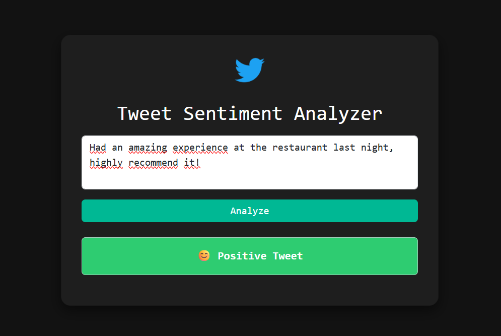

### Sentiment Analysis of Tweets

This project explores the use of **three-class sentiment classification** applied to **Twitter data**.  
The goal is to automatically determine the sentiment expressed in a tweet - *positive*, *negative*, or *neutral* - using **Natural Language Processing (NLP)** and **Machine Learning** techniques.  

The developed model achieves an **accuracy of 89%** on the test dataset and has been deployed as a **web application** using the **Flask** framework for real-time sentiment prediction.

ML Model Deployment Interface

  

**Yassine DARIF** | INSEA-2025
